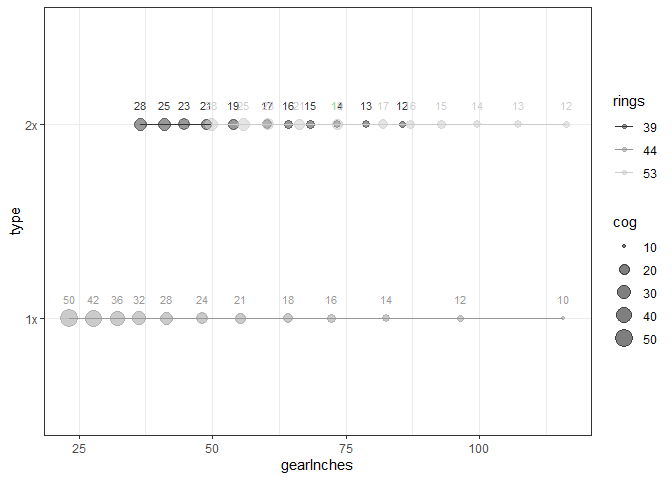

Calculating and Comparing Bicycle Gears
================

**Credit:** The code and the considerable work in curating the
`cassette_key.csv` dataset, in working out the logic underlying the
functions in `bicycle_gears.R`, and the examples for each function was
all done by David Roberts and described - along with commentary on why
one front chainring (1x) is better than two (2x) in in his April 6 2016
blog post from [Cycling gear ratio calculator for R (or why you should
just go buy a SRAM Eagle 1×12 group right
now)](https://davidrroberts.wordpress.com/2016/04/06/cycling-gear-ratio-calculator-for-r-or-why-you-should-just-go-buy-a-sram-eagle-1x12-group-right-now/).

I was interested in exploring different combinations, so naturally the
first thing I did was search Google for “R bicycle gear ratios” and came
across his blog post. Then decided to post on GitHub to make it easier
for others to use.

Things you can do to contribute: - Improve & extend figures - Develop a
shiny app - Finish converting into an R package

-   Functions are in `R/bicycle_gears.R`.
-   Data is in `data/cassette_key.csv`.

## Read in data and functions

    ## Warning: package 'dplyr' was built under R version 4.0.3

    ## # A tibble: 79 x 47
    ##    Manufact  NSpeeds SmallCog LargeCog    T9   T10   T11   T12   T13   T14   T15
    ##    <chr>       <dbl>    <dbl>    <dbl> <dbl> <dbl> <dbl> <dbl> <dbl> <dbl> <dbl>
    ##  1 campagno~      10       11       23    NA    NA    11    12    13    14    15
    ##  2 campagno~      10       11       25    NA    NA    11    12    13    14    15
    ##  3 campagno~      10       12       23    NA    NA    NA    12    13    14    15
    ##  4 campagno~      10       12       25    NA    NA    NA    12    13    14    15
    ##  5 campagno~      10       12       27    NA    NA    NA    12    13    14    15
    ##  6 campagno~      10       12       30    NA    NA    NA    12    13    14    15
    ##  7 campagno~      10       13       26    NA    NA    NA    NA    13    14    15
    ##  8 campagno~      10       13       29    NA    NA    NA    NA    13    14    15
    ##  9 campagno~      10       14       23    NA    NA    NA    NA    NA    14    15
    ## 10 campagno~      11       11       23    NA    NA    11    12    13    14    15
    ## # ... with 69 more rows, and 36 more variables: T16 <dbl>, T17 <dbl>,
    ## #   T18 <dbl>, T19 <dbl>, T20 <dbl>, T21 <dbl>, T22 <dbl>, T23 <dbl>,
    ## #   T24 <dbl>, T25 <dbl>, T26 <dbl>, T27 <dbl>, T28 <dbl>, T29 <dbl>,
    ## #   T30 <dbl>, T31 <dbl>, T32 <dbl>, T33 <dbl>, T34 <dbl>, T35 <dbl>,
    ## #   T36 <dbl>, T37 <dbl>, T38 <dbl>, T39 <dbl>, T40 <dbl>, T41 <lgl>,
    ## #   T42 <dbl>, T43 <lgl>, T44 <dbl>, T45 <dbl>, T46 <dbl>, T47 <lgl>,
    ## #   T48 <lgl>, T49 <lgl>, T50 <dbl>, T51 <dbl>

## Functions

### getCogs

    ##  [1] 10 12 14 16 18 21 24 28 32 36 42 50

    ##  [1]  9 10 11 12 13 14 16 18 21 25 30 36 42

### Calculate Wheel Size

    ## [1] 2091

    ## [1] 2099

### Generate tables of gear ratios, gear inches, speeds at different RPMs

    ##  [1] 12 13 14 15 16 17 19 21 23 25 28

    ## $`39T`
    ## # A tibble: 11 x 7
    ##    chainring   cog gearRatio gearInches develMetres KPH.50RPM KPH.100RPM
    ##        <dbl> <dbl>     <dbl>      <dbl>       <dbl>     <dbl>      <dbl>
    ##  1        39    12      3.25       85.5        6.82     20.5        40.9
    ##  2        39    13      3          78.9        6.3      18.9        37.8
    ##  3        39    14      2.79       73.4        5.86     17.6        35.2
    ##  4        39    15      2.6        68.4        5.46     16.4        32.8
    ##  5        39    16      2.44       64.2        5.12     15.4        30.7
    ##  6        39    17      2.29       60.2        4.81     14.4        28.9
    ##  7        39    19      2.05       53.9        4.3      12.9        25.8
    ##  8        39    21      1.86       48.9        3.9      11.7        23.4
    ##  9        39    23      1.7        44.7        3.57     10.7        21.4
    ## 10        39    25      1.56       41.0        3.27      9.81       19.6
    ## 11        39    28      1.39       36.6        2.92      8.76       17.5
    ## 
    ## $`53T`
    ## # A tibble: 11 x 7
    ##    chainring   cog gearRatio gearInches develMetres KPH.50RPM KPH.100RPM
    ##        <dbl> <dbl>     <dbl>      <dbl>       <dbl>     <dbl>      <dbl>
    ##  1        53    12      4.42      116.         9.28      27.8       55.7
    ##  2        53    13      4.08      107.         8.56      25.7       51.4
    ##  3        53    14      3.79       99.7        7.96      23.9       47.8
    ##  4        53    15      3.53       92.8        7.41      22.2       44.5
    ##  5        53    16      3.31       87.1        6.95      20.8       41.7
    ##  6        53    17      3.12       82.1        6.55      19.6       39.3
    ##  7        53    19      2.79       73.4        5.86      17.6       35.2
    ##  8        53    21      2.52       66.3        5.29      15.9       31.7
    ##  9        53    23      2.3        60.5        4.83      14.5       29.0
    ## 10        53    25      2.12       55.8        4.45      13.4       26.7
    ## 11        53    28      1.89       49.7        3.97      11.9       23.8

## Make a plot comparing 1x and 2x options

    ##  [1] 12 13 14 15 16 17 19 21 23 25 28

    ##  [1] 10 12 14 16 18 21 24 28 32 36 42 50

    ## Warning: package 'ggplot2' was built under R version 4.0.3

<!-- -->
